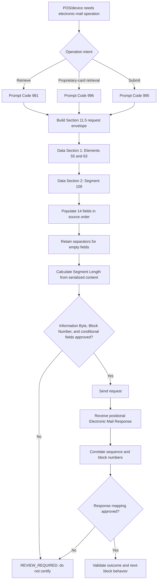

# Segment 109 End-to-End Flow

```mermaid
flowchart TD
    A[POS/device needs electronic-mail operation] --> B{Operation intent}
    B -->|Retrieve| C[Prompt Code 981]
    B -->|Proprietary-card retrieval| D[Prompt Code 996]
    B -->|Submit| E[Prompt Code 995]
    C --> F[Build Section 11.5 request envelope]
    D --> F
    E --> F
    F --> G[Data Section 1: Elements 55 and 63]
    G --> H[Data Section 2: Segment 109]
    H --> I[Populate 14 fields in source order]
    I --> J[Retain separators for empty fields]
    J --> K[Calculate Segment Length from serialized content]
    K --> L{Information Byte, Block Number, and conditional fields approved?}
    L -->|No| M[REVIEW_REQUIRED: do not certify]
    L -->|Yes| N[Send request]
    N --> O[Receive positional Electronic Mail Response]
    O --> P[Correlate sequence and block numbers]
    P --> Q{Response mapping approved?}
    Q -->|No| M
    Q -->|Yes| R[Validate outcome and next-block behavior]
```

The review paths are intentional. They prevent a syntactically valid Segment 109 fixture from becoming false proof of an approved operational flow.