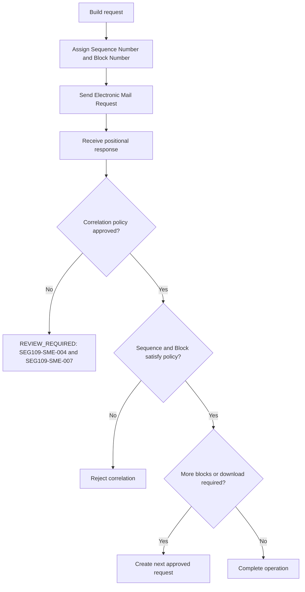

# Sequence and Block Lifecycle Flow

```mermaid
flowchart TD
    A[Build request] --> B[Assign Sequence Number and Block Number]
    B --> C[Send Electronic Mail Request]
    C --> D[Receive positional response]
    D --> E{Correlation policy approved?}
    E -->|No| F[REVIEW_REQUIRED: SEG109-SME-004 and SEG109-SME-007]
    E -->|Yes| G{Sequence and Block satisfy policy?}
    G -->|No| H[Reject correlation]
    G -->|Yes| I{More blocks or download required?}
    I -->|Yes| J[Create next approved request]
    I -->|No| K[Complete operation]
```