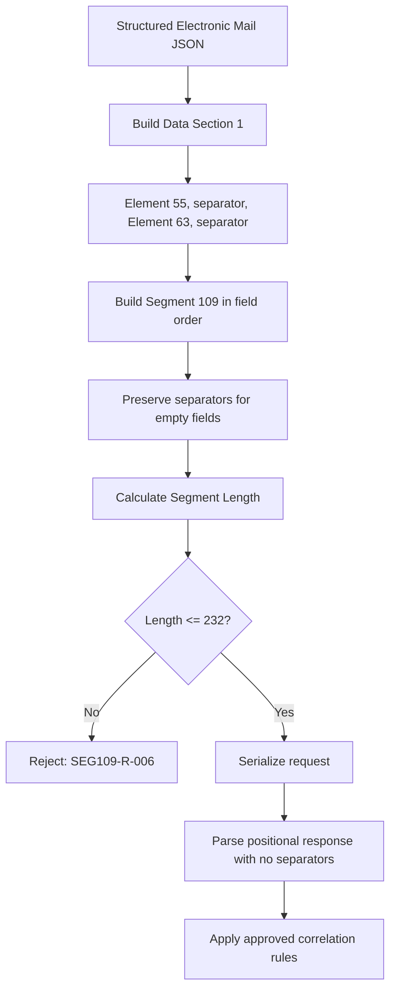

# Segment 109 Serialization and Wire-Format Flow

```mermaid
flowchart TD
    A[Structured Electronic Mail JSON] --> B[Build Data Section 1]
    B --> C[Element 55, separator, Element 63, separator]
    C --> D[Build Segment 109 in field order]
    D --> E[Preserve separators for empty fields]
    E --> F[Calculate Segment Length]
    F --> G{Length <= 232?}
    G -->|No| H[Reject: SEG109-R-006]
    G -->|Yes| I[Serialize request]
    I --> J[Parse positional response with no separators]
    J --> K[Apply approved correlation rules]
```