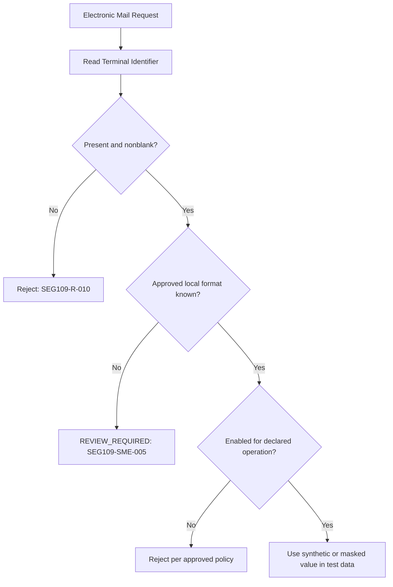

# Terminal Identifier Decision Flow

```mermaid
flowchart TD
    A[Electronic Mail Request] --> B[Read Terminal Identifier]
    B --> C{Present and nonblank?}
    C -->|No| D[Reject: SEG109-R-010]
    C -->|Yes| E{Approved local format known?}
    E -->|No| F[REVIEW_REQUIRED: SEG109-SME-005]
    E -->|Yes| G{Enabled for declared operation?}
    G -->|No| H[Reject per approved policy]
    G -->|Yes| I[Use synthetic or masked value in test data]
```