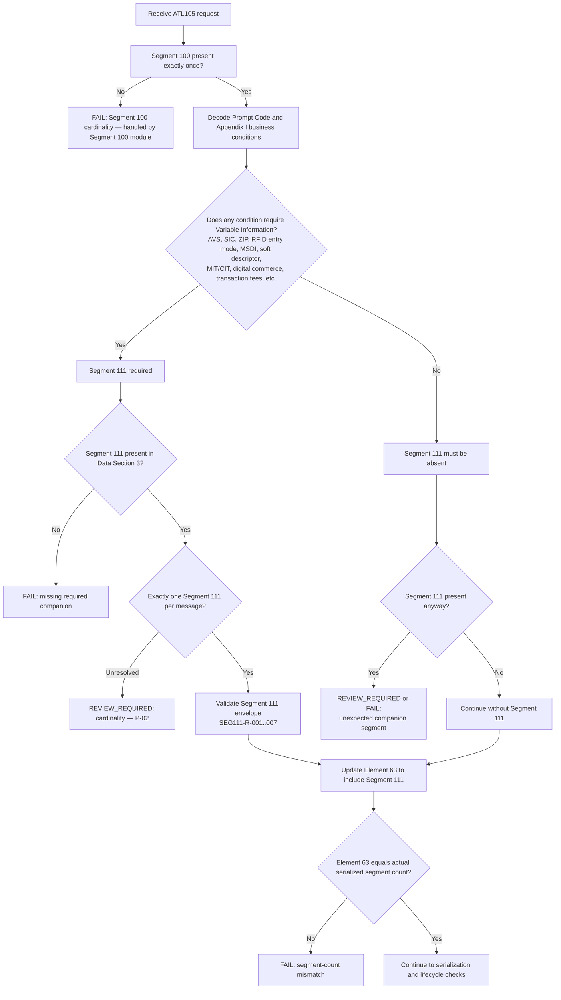

# Segment 111 Companion-Segment Compatibility Decision Flow



## Decision Summary

```text
Segment 100 is the baseline (validated by the Segment 100 module).
Segment 111 is condition-driven, not universal.
Segment 111 validates only its own envelope; Appendix I content is out of scope.
Element 63 must count Segment 111 when it is present.
Unresolved cardinality (more than one Segment 111) is reviewed, not auto-passed.
```

## Related Diagram

See the Segment 100
[companion-segment compatibility flow](../../segment-100/companion-compatibility/companion-segment-compatibility-flow.md)
for the parent decision that routes into this one (`Variable information? ->
Require Segment 111`).
