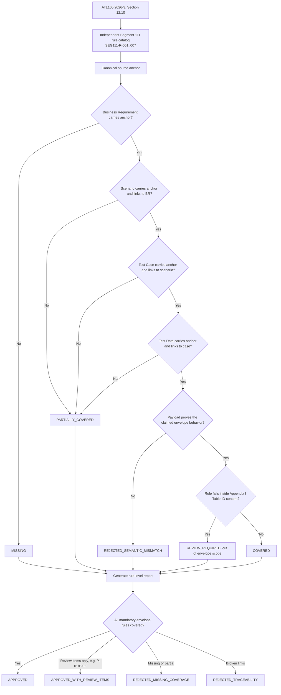

# Segment 111 Coverage Closure Flow

## Human Checkpoints

### Checkpoint 1: Scope approval

The SME/TBA confirms that the Segment 111 rule catalog covers the envelope
only (`SEG111-R-001..007`) and that Appendix I Table-ID content remains
explicitly out of scope for this release.

### Checkpoint 2: Rule catalog approval

The Test Team confirms that each catalog row is atomic, sourced to Section
12.10, and testable.

### Checkpoint 3: Artifact mapping approval

The Test Team confirms that source anchors are semantically equivalent even
when local IDs differ between the AI-generated package and the canonical
catalog.

### Checkpoint 4: Semantic evidence approval

The SME/TBA confirms that the payload actually represents the intended
envelope behavior — for example, that a "length mismatch" negative fixture
truly declares a length that disagrees with its value, not merely that a
test case is labeled as negative.

### Checkpoint 5: Certification approval

The Test Team decides whether `P-01`, `P-02`, and any other review items
block release, and records the decision alongside the report.

## Important Principle

A percentage such as "100% mutation detection" is not sufficient evidence of
full coverage. The report must identify the exact rule, the exact provisional
item, and the exact reason a rule is not yet `COVERED`.
