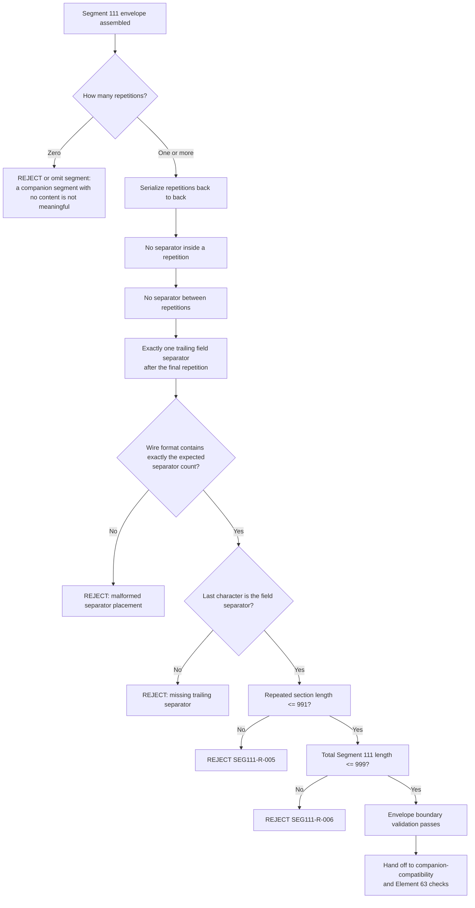

# Repeated-Section and Separator Boundary Flow

## Key Distinction

This is the Segment 111 analogue of the Segment 100
["final closure" serialization rule](../segment-100/final-closure-flow.md):
an empty or malformed position inside a fixed-order message shifts every
later value. Segment 111 has no field-level "empty middle field" concept
because it is a pure repeating structure, but it has the same category of
risk in a different shape:

| Segment 100 risk | Segment 111 equivalent risk |
| --- | --- |
| Empty non-trailing field loses its separator | A separator appears inside or between repetitions where none is allowed |
| Trailing optional field omitted | The single trailing separator is omitted or duplicated |
| Reordered field | Repetitions serialized out of the order they were declared in |

`Segment111SerializationValidator` checks the wire-format string directly
(exactly three field separators, with the last character being the
separator) because a JSON structural check alone cannot prove that the
literal bytes are correct.

## Provisional Items Affecting This Boundary

Recorded in `SEGMENT-111-CONSOLIDATED-REPORT.txt` and not yet resolved by
SME:

- **P-01**: Ship-to/Ship-from Postal Code format (ZIP+4 vs. any valid postal
  code) may affect the expected value length for at least one Table ID and
  therefore the repeated-section total.
- **P-02**: Segment 111 cardinality — whether at most one Segment 111 may
  appear per message, by analogy to the confirmed Segment 101 rule
  (`SEG101-R-026`). Until resolved, cardinality above one is `REVIEW_REQUIRED`,
  not silently accepted.
