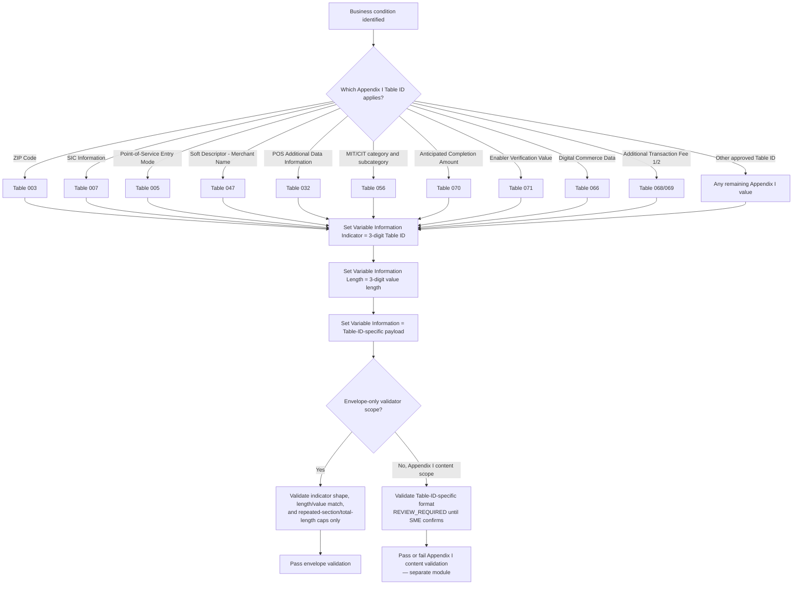

# Variable Information Indicator (Table ID) Dependency Flow

## Key Insight

The Variable Information Indicator is a **discriminator**, not free text: its
value selects which Appendix I Table ID layout governs the accompanying value.
The current validator checks only that the indicator is a present three-digit
field (`SEG111-R-003`); it does not yet decode the Table ID to select a
Table-ID-specific value grammar. That decoding is explicitly parked as
`REVIEW_REQUIRED` (see [SME/TBA note](variable-information-indicator-sme-tba-note.md),
question 1) until the SME confirms which identifiers are in scope for the current
release.

## Grounded Table ID Examples

These Table IDs are cited directly in the approved requirement catalog
(`test-output/ai-artifacts/business-requirements/POC-AI-ATL105-Segment-111-Business-Requirements.md`)
and are used here only to illustrate the discriminator pattern, not to certify
their business rules:

| Table ID | Business meaning | Source requirement |
| --- | --- | --- |
| `003` | ZIP Code (reporting only, not validated by issuer) | BR-129-6 |
| `005` | Point-of-Service Entry Mode | BR-143-1 |
| `007` | SIC Information (MCC of underlying retailer) | BR-83-5, BR-142-3 |
| `018` | Terminal ID (TPP/VAR ID) | BR-46-3 |
| `032` | POS Additional Data Information | BR-143-2 |
| `047` | Soft Descriptor - Merchant Name | BR-142-1, BR-142-2 |
| `056` | MIT/CIT category and subcategory data | BR-142-4, BR-143-3 |
| `066` | Digital Commerce Data | BR-12-2, BR-12-3 |
| `068` / `069` | Additional Transaction Fee 1 / 2 | BR-11-1, BR-11-2 |
| `070` | Anticipated Completion Amount | BR-11-5, BR-12-5 |
| `071` | Enabler Verification Value | BR-7-1 |
