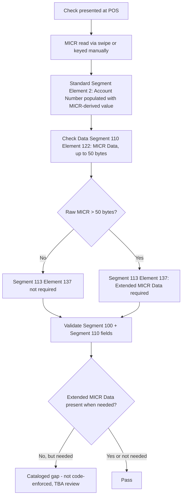

## Key Insight

Unlike Segment 108's field-order quirk or Segment 103's WIC subelements, Segment 113's account-number-related nuance is a **cross-segment** one (100 <-> 110 <-> 113), not a within-segment field rule. The payload validator only checks Segment 113's own Extended MICR Data length bound; the cross-segment MICR consistency is documented here for manual/TBA review, per `SEG113-SME-004`.
