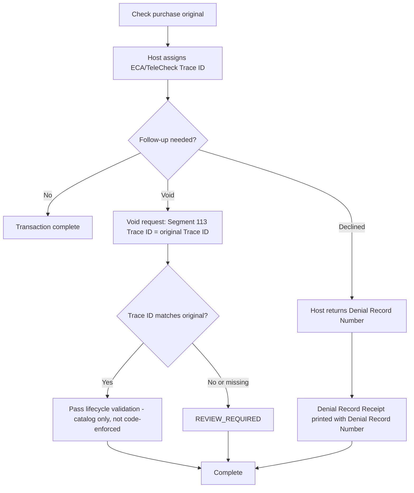

## Key Principle

For Segment 113, the Void-to-original correlation identifier is the ECA/TeleCheck Trace ID (Element 134), not Segment 100's Sequence Number alone. Treating a Void as "just another Sequence Number reuse" like a generic Financial Transaction reversal misses this segment-specific rule.
