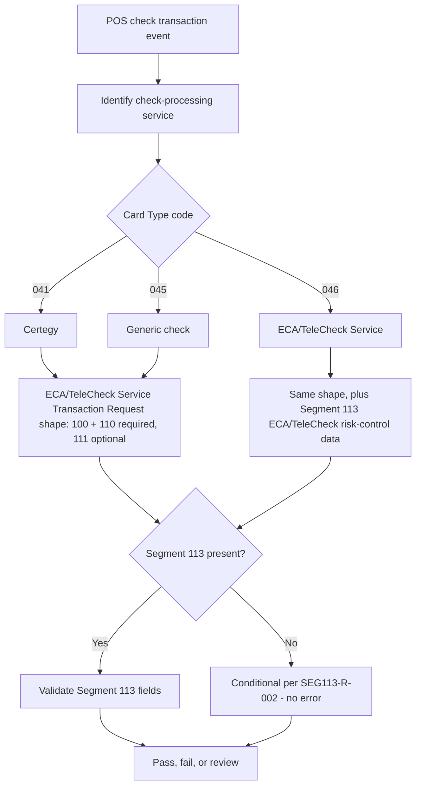

## What the Flow Teaches

- Card Type `041`/`045`/`046` all select the same ECA/TeleCheck Service Transaction Request message shape; only `046` is the literal "ECA/TeleCheck" processor.
- Segment 113's presence is conditional, not tied to a hard Card-Type-driven code rule in the current validator (per SME resolution 2026-09-22).
- A negative test should change the Card Type independently from Segment 113's presence/absence to isolate which condition is actually being tested.
