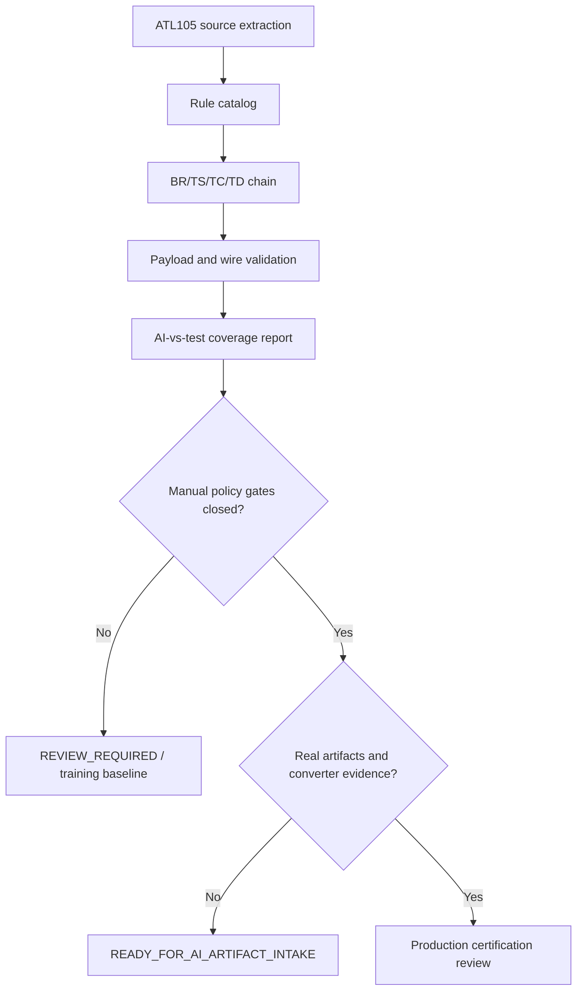

# Segment 119 Final Closure Flow

```mermaid
flowchart TD
    A[ATL105 source extraction] --> B[Rule catalog]
    B --> C[BR/TS/TC/TD chain]
    C --> D[Payload and wire validation]
    D --> E[AI-vs-test coverage report]
    E --> F{Manual policy gates closed?}
    F -->|No| G[REVIEW_REQUIRED / training baseline]
    F -->|Yes| H{Real artifacts and converter evidence?}
    H -->|No| I[READY_FOR_AI_ARTIFACT_INTAKE]
    H -->|Yes| J[Production certification review]
```
