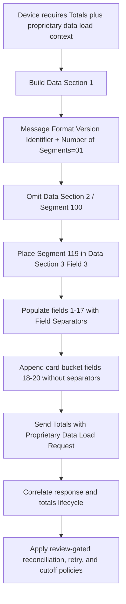

# Segment 119 End-to-End Flow

Segment 119 is a totals-specific alternative message path. It is not an ordinary Financial Transaction companion segment: ATL105 Section 11.4.1.2 explicitly says the request contains Data Sections 1 and 3 and does not contain Data Section 2.
