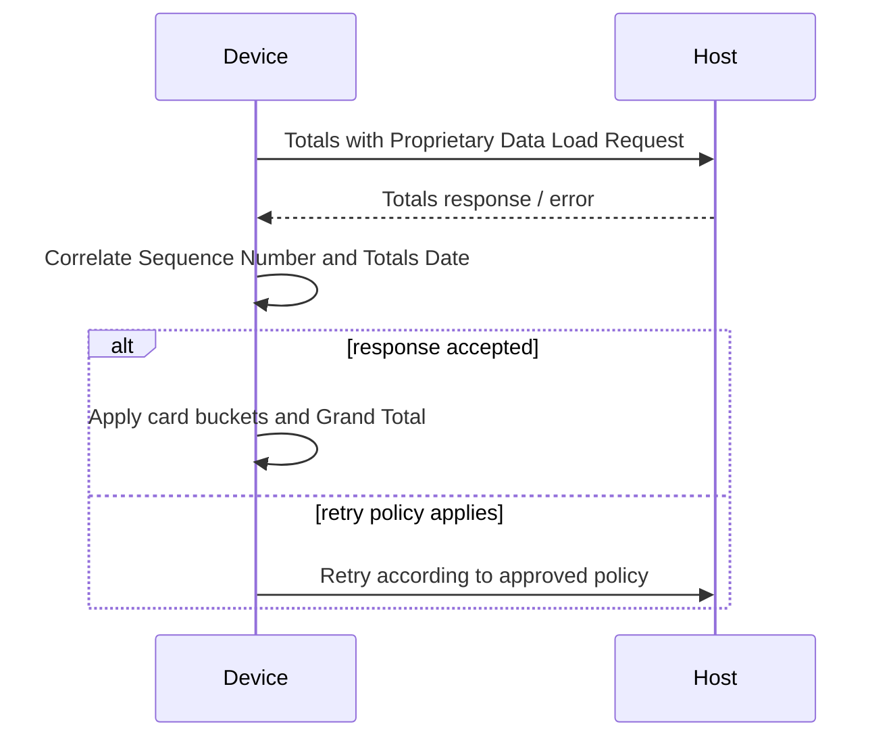

# Segment 119 Request/Response Lifecycle Flow

```mermaid
sequenceDiagram
    participant Device
    participant Host
    Device->>Host: Totals with Proprietary Data Load Request
    Host-->>Device: Totals response / error
    Device->>Device: Correlate Sequence Number and Totals Date
    alt response accepted
        Device->>Device: Apply card buckets and Grand Total
    else retry policy applies
        Device->>Host: Retry according to approved policy
    end
```

The retry branch remains a review gate; this flow does not invent timing or duplicate semantics.
