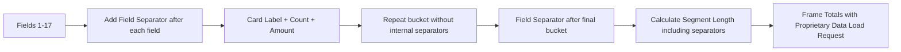

# Segment 119 Serialization and Wire-Format Flow

```mermaid
flowchart LR
    A[Fields 1-17] --> B[Add Field Separator after each field]
    B --> C[Card Label + Count + Amount]
    C --> D[Repeat bucket without internal separators]
    D --> E[Field Separator after final bucket]
    E --> F[Calculate Segment Length including separators]
    F --> G[Frame Totals with Proprietary Data Load Request]
```
