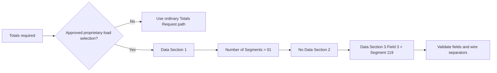

# Segment 119 Totals Request Structure Flow

```mermaid
flowchart LR
    A[Totals required] --> B{Approved proprietary-load selection?}
    B -->|No| C[Use ordinary Totals Request path]
    B -->|Yes| D[Data Section 1]
    D --> E[Number of Segments = 01]
    E --> F[No Data Section 2]
    F --> G[Data Section 3 Field 3 = Segment 119]
    G --> H[Validate fields and wire separators]
```
