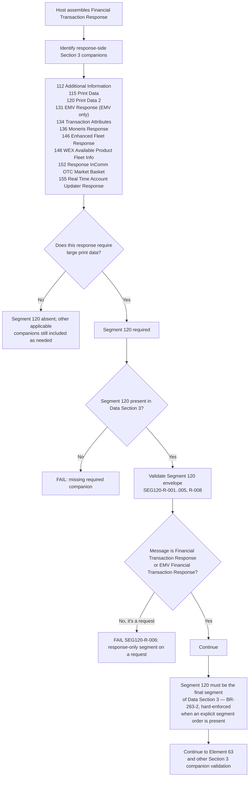

# Segment 120 Companion-Segment Compatibility Decision Flow



## Decision Summary

```text
Segment 100 is the request-side baseline (validated by the Segment 100 module).
Segment 120 is a condition-driven response-side companion — never on a request.
Segment 120 validates its own envelope AND its position: it must be the
final segment of Data Section 3 (P-01 resolved 2026-09-23).
```

## Related Diagram

Segment 120 sits alongside a different companion family than Segment 100's
request-side companions (101, 102, 103, 104, 111, 123, 130, 135). See the
Segment 100 [companion-segment compatibility flow](../../segment-100/companion-compatibility/companion-segment-compatibility-flow.md)
for the request-side decision tree that this response-side flow complements.
