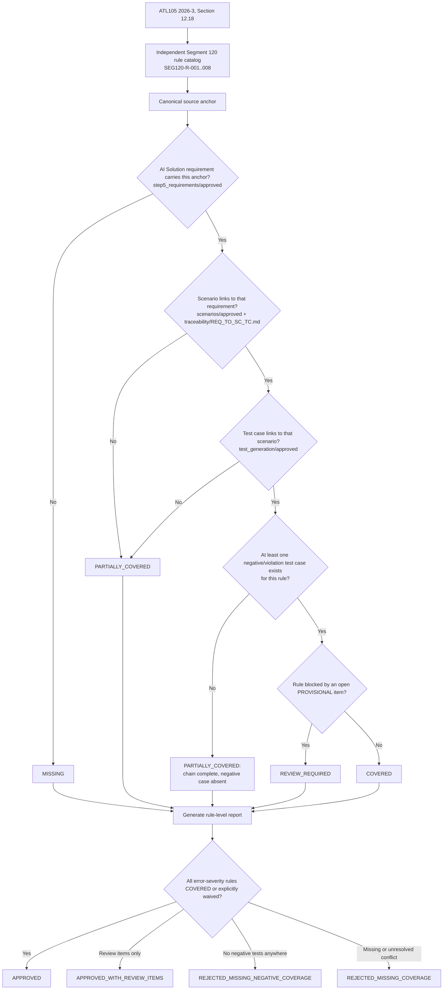

# Segment 120 Coverage Closure Flow

## Human Checkpoints

### Checkpoint 1: Scope approval

The SME/TBA confirms the 8-rule Segment 120 catalog boundary, including whether Blackhawk
delimiter content validation (`P-03`) belongs in this module.

### Checkpoint 2: Rule catalog approval

The Test Team confirms each catalog row is atomic, sourced to Section 12.18 (or the relevant
page for cross-segment relationship rules), and testable.

### Checkpoint 3: Evidence mapping approval

The Test Team confirms the REQ→SC→TC evidence counts pulled from
`src_Harit_Latest_AI_Sol/src/pipeline/traceability/markdown/REQ_TO_SC_TC.md` are current and
that `REQ-SRC-ATL105-PDF-001:1261`'s `UNASSIGNED` bucketing has been corrected upstream or is
tracked here permanently.

### Checkpoint 4: Ordering-conflict resolution (`P-01`) — RESOLVED 2026-09-23

The AI-generated template ordering (`atl105_complete_templates.json`) was found to list response
segments in strict ascending segment-number order in both the Financial Transaction Response and
EMV Financial Transaction Response templates — matching the pattern of the spec's own numeric
cross-reference appendices, not a documented wire-order table. This is assessed as a numeric-sort
extraction artifact. **The literal spec sentence (`BR-263-2`) is authoritative**: Segment 120 is
the final segment of Data Section 3, and this is now hard-enforced when an explicit segment order
is available in test data. Re-open this checkpoint if a real (non-synthetic) message ever shows a
companion segment following Segment 120.

### Checkpoint 5: Certification approval

The Test Team decides whether the complete absence of negative test cases blocks release, and
whether `P-02-RESIDUAL`/`P-03`/`P-04` must be resolved before `APPROVED_WITH_REVIEW_ITEMS` can be granted.

## Important Principle

A 100% AI-requirement-to-rule mapping score (as shown in the
[AI vs Test Solution analysis](segment-120-ai-vs-test-solution-analysis.md)) is not the same as
adequate test evidence. Segment 120 demonstrates both extremes at once: perfect semantic mapping
alongside zero negative-test coverage. It also demonstrates that an apparent internal
contradiction inside AI-generated artifacts can sometimes be resolved by careful re-reading of the
same artifacts (see `P-01`'s resolution above) rather than requiring an external SME call — but
that resolution should still be reviewed, not assumed permanent.
