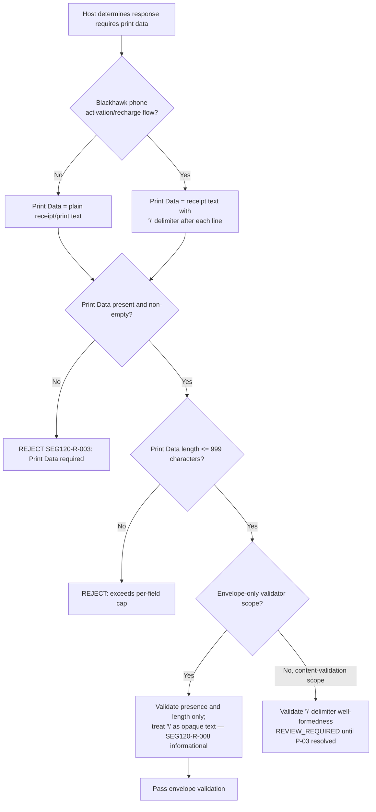

# Print Data Content Dependency Flow



## Key Insight

Print Data is unstructured free text, unlike Segment 111's Table-ID-keyed
repetitions. The only documented internal structure is the `\` line
delimiter used for Blackhawk phone activation/recharge receipts (BR-263-5):

```text
Line of text\line of text\line of text
```

The current validator treats this as **content**, not **envelope**: it does
not parse or require well-formed `\` delimiters, because whether that belongs
in this module's scope is an open question (`P-03`, see the
[coverage SME note](coverage/segment-120-coverage-sme-tba-note.md)).

## A Mis-Bucketed Requirement

`REQ-SRC-ATL105-PDF-001:1261` (BR-263-5) is the AI Solution's own requirement
statement for this delimiter behavior — but the pipeline's segment-bucketing
step tagged it `UNASSIGNED` instead of `SEG-120`, even though its scenario
(`SC-1842`) and test cases (`TC-4311`, `TC-4312`) are exclusively about
Segment 120 Print Data. This knowledge base attributes it correctly as
`SEG120-R-008`; see the
[AI vs Test Solution analysis](coverage/segment-120-ai-vs-test-solution-analysis.md)
for the full cross-reference.
