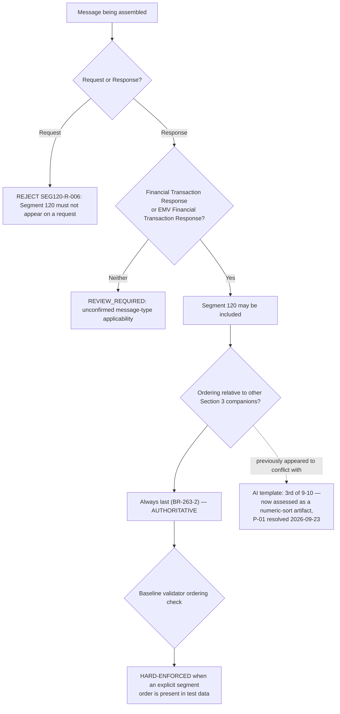

# Response-Only Placement and Ordering Dependency Flow

## Key Distinction

This topic combines two related but separate questions:

1. **Applicability** (`SEG120-R-006`): is Segment 120 even legal in this
   message? Answer: only in a Financial Transaction Response or EMV
   Financial Transaction Response — never a request. This is confirmed by
   three independent AI-generated requirements (`BR-263-1` and both
   `SEGMENT_USED_IN_TRANSACTION` relationship requirements) and is
   hard-enforced when a message-type signal is available.
2. **Ordering** (`SEG120-R-007`): given that Segment 120 is legal in this
   message, where must it sit relative to the other Section 3 companion
   segments? Answer: **at the end**, per `BR-263-2`. This was briefly
   thought to conflict with the AI-generated message template's ordering,
   but that ordering was determined to be a numeric-sort extraction
   artifact (`P-01`, resolved 2026-09-23) — see the
   [coverage SME note](coverage/segment-120-coverage-sme-tba-note.md).
   `SEG120-R-007` is now hard-enforced when an explicit segment order is
   present in test data.

Conflating these two would either over-reject (treating every response with
Segment 120 not literally last as invalid before the ordering question was
settled) or under-validate (never checking applicability at all). Keep them
as two separate rule IDs and two separate test categories.
