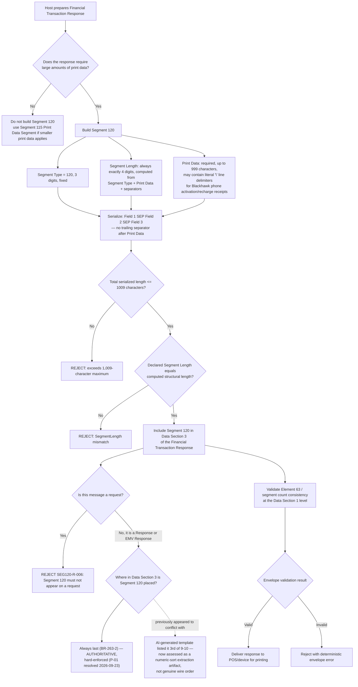

# Segment 120 End-to-End Flow

This diagram shows the decision path for Segment 120 (Print Data 2 Segment) as a
conditional, **response-side** companion segment in Data Section 3 of a
Financial Transaction Response or EMV Financial Transaction Response. Unlike
Segment 100/101/111, Segment 120 never appears on a request.

## How to Read the Flow

- The top branch is the host-side business trigger: Segment 120 exists only when the
  response "requires large amounts of print data" (BR-263-1) — a condition the client
  determines, not something this envelope validator can independently confirm.
- The middle branch is the fixed 3-field structure this knowledge base module validates.
- The **ordering question** (`I1` vs `I2`) is now resolved: the AI Solution's own generated
  message templates order segments by ascending segment number, a numeric-sort extraction
  artifact rather than genuine wire-order evidence, so the literal specification sentence
  (`I1`) is authoritative and is hard-enforced. See
  [`SEG120-R-007` / `P-01`](coverage/segment-120-coverage-sme-tba-note.md) for the full
  reasoning, and revisit it if a real message ever contradicts it.
- **This deliverable validates only the envelope** (Segment Type, Segment Length, Print Data
  presence/length, separator placement, response-only applicability). It does not validate
  receipt-formatting business logic beyond the `\` line-delimiter convention.

## Related Segment 100 Decision

Segment 120 is one of the response-side companions implied by the Segment 100
family of message flows once a response is being assembled; see the Segment 100
[end-to-end flow](../segment-100/segment-100-flow.md) for the request-side
counterpart of this decision tree.
