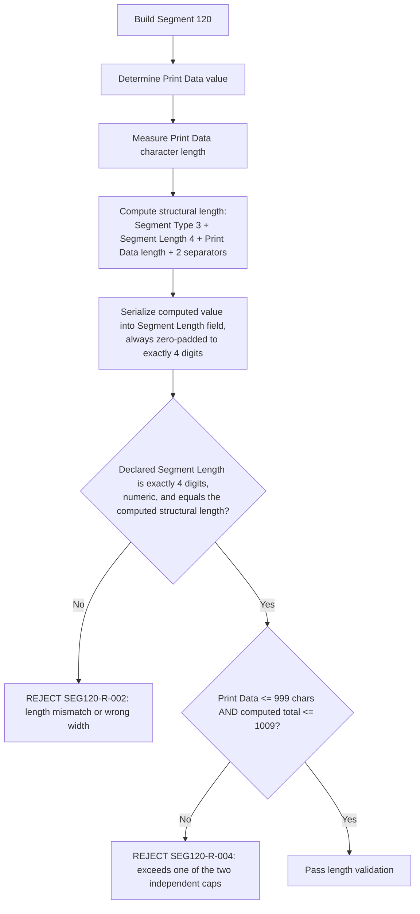

# Segment Length Encoding Dependency Flow

## Key Principle: A Confirmed Fixed 4-Digit Field Width

Segment 100, 101, and 111 all use a **fixed 3-digit** Segment Length field.
Segment 120 is different, and this is now **confirmed**, not merely
suspected: `regression-artifact-validator/docs/specs/extracted_text.txt`
lines 21313-21340 (Element 84 definition, page 13-66) states outright that
"Segment Length has a length of four digits in the following seven
instances only" — naming Segment 120 among the seven (103, 114, 115, 118,
**120**, 130, 131) — and "It cannot have a length of 4 digits when sending
any other segment."

**Resolution (`P-02-WIDTH`, 2026-09-23):** Segment 120's Segment Length is
always exactly 4 digits, zero-padded (e.g. `0024`, `1009`). BR-400-18's
"001-1009" phrasing is a lossy simplification of the true zero-padded
4-digit range by the AI extraction pipeline, not evidence of variable width.
The validator now uses a strict `^[0-9]{4}$` pattern for this field, matching
Element 84's own definition rather than reusing Segment 100/101/111's
3-digit convention.

## Two Interacting Caps (Still Partially Open)

There are two length caps that must not be confused, and one small
arithmetic gap between them remains unresolved:

1. **Per-field cap**: Print Data itself is capped at 999 characters
   (Field 3's `Len.` in the spec table).
2. **Whole-segment cap**: the total encoded Segment 120 — Segment Type (3) +
   Segment Length (4) + Print Data + 2 separators — must not exceed 1,009
   characters (BR-263-3).

Arithmetic check: `1009 - 3 - 4 - 2 = 1000`, not `999`. This 1-character gap
(`P-02-RESIDUAL`) is unresolved; the validator enforces **both** caps
independently as a safety measure rather than deriving one from the other.
See the [coverage SME note](coverage/segment-120-coverage-sme-tba-note.md)
for the full discussion.
