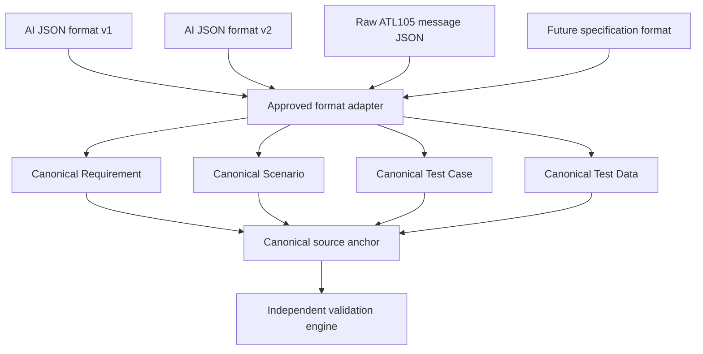
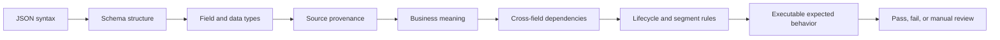

# AI Generation Output Validation Summary

## Core Auth Regression Test Solution

**Current foundation:** ATL105  
**End goal:** Generate and validate test artifacts for any specification

## 1. Business Problem

AI artifacts can be valid JSON while still being incomplete, untraceable, semantically wrong, or based on unapproved knowledge. The Test Solution is the independent quality gate.

## 2. AI Generation Workflow

```text
Specification
  -> profile/extract
  -> knowledge model
  -> knowledge approval
  -> requirements
  -> scenarios
  -> scenario approval
  -> prioritization
  -> test cases
  -> test-case approval
  -> test data/suite
  -> traceability/coverage
```

## 3. Test Solution and Validation

```text
AI output
  -> preserve
  -> normalize
  -> validate stages
  -> validate provenance/approvals
  -> Rule -> BR -> Scenario -> Case -> Data
  -> validate ATL105 semantics
  -> independent coverage
  -> decision/report/manual review
```

The Test Solution compares AI claims with independent rules and evidence at every stage.

Before broad acceptance, the Test Team manually validates only a small, risk-based handful of high-risk AI artifacts against canonical Test Solution artifacts, independent specification rules, and expected business behavior. This targeted sample confirms compatible results for high-impact items; it does not replace automated validation or formal approval.

## 4. Approval Gates

```text
Knowledge review
  -> Scenario review
  -> Test-case review
```

Confidence scoring can prioritize attention but cannot replace SME/TBA approval.

## 5. Traceability

```text
Approved source rule
  -> Business Requirement
      -> Test Scenario
          -> Test Case
              -> Test Data
                  -> Executable payload
```

## Canonical Approach



Different local IDs and JSON property names may be accepted when artifacts map to the same canonical source anchor and meaning.

## Semantic Approach



```text
Structural validation asks:
  Is the JSON shaped correctly?

Semantic validation asks:
  Does the JSON represent valid specification and business behavior?
```

Example: `segmentType = 101` may be valid JSON, but it is semantically invalid when the test claims to represent Segment 100.

## 6. ATL105 Foundation Plan

```text
ATL105 foundation plan
  -> establish specification profile and source rule catalog
  -> define all ATL105 segments and message categories
  -> derive requirements, scenarios, cases, and test data
  -> define approvals, traceability, coverage, and dependency governance
  -> expand module by module across the complete ATL105 scope
```

## 7. Coverage and Reporting

**Proposed model — pending Fiserv Leadership approval.**

```text
Rule Coverage = mandatory rules with complete executable evidence
                / mandatory rules in the independent rule catalog x 100
```

Additional metrics include requirement, scenario, test-case, test-data, traceability, semantic-execution, parameter, and segment coverage.

## 8. Governance and Decision

Unknown or ambiguous combinations are held for manual review and are not auto-approved or auto-rejected.

## 9. RAID Log

**Scope:** Any available specification  
**Current proof of concept:** ATL105

| Category | ID | Dependency | Required For | Owner | Status |
| --- | --- | --- | --- | --- | --- |
| Dependency | D-001 | Manual validation of a representative AI artifact sample against Test Solution output | Confirm compatible expected results before broader acceptance | Coforge Test Team | Open |
| Dependency | D-002 | Availability of an SME/TBA or delegated business approver | Review and approve knowledge, scenarios, test cases, ambiguous rules, and business certification |  | Blocked |

Allowed statuses: `Open`, `In Progress`, `Blocked`, `Accepted`, `Closed`.

## 10. End Goal

```text
Any specification
  -> specification pack
  -> independent rule catalog
  -> generate BRs
  -> generate scenarios
  -> generate test cases
  -> generate test data
  -> validate AI equivalents
  -> coverage and approval report
  -> approved regression suite
```
