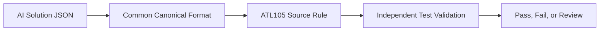
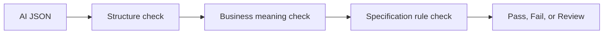

# AI Generation Output Validation Summary

## Core Auth Regression Test Solution

**Current foundation:** ATL105  
**End goal:** Generate and validate test artifacts for any specification

## 1. Business Problem

AI artifacts can be valid JSON while still being incomplete, untraceable, semantically wrong, or based on unapproved knowledge. The Test Solution is the independent quality gate.

## 2. AI Solution Outcomes

The AI Solution provides outcome artifacts for Test Validation:

| AI outcome | What it contains | Validation focus |
| --- | --- | --- |
| Knowledge model | Fields, rules, values, relationships, source references | Provenance, confidence, flags, approvals |
| Business Requirements | Testable statements derived from source rules | Source mapping, completeness, atomicity |
| Test Scenarios | Business situations to be tested | Relevance, classification, missing scenarios |
| Test Cases | Objectives, conditions, expected results, links | Traceability, consistency, approval state |
| Test Data JSON | Requests, field values, lifecycle data | Schema, semantics, serialization, executability |
| Traceability/coverage | Artifact links and reported metrics | Independent recalculation and discrepancy checks |

## 3. Test Validation Stages

```text
AI outcome artifacts
  -> preserve original files
  -> detect format and normalize
  -> validate each outcome structure
  -> validate source provenance and approvals
  -> validate Rule -> BR -> Scenario -> Case -> Data
  -> validate ATL105 semantics
  -> independently calculate coverage
  -> manual high-risk sample comparison
  -> final decision and report
```

The Test Solution validates the AI outcomes. It does not need to reproduce the AI generation process to determine whether the outcomes are complete, traceable, and correct.

Before broad acceptance, the Test Team manually validates only a small, risk-based handful of high-risk AI artifacts against canonical Test Solution artifacts, independent specification rules, and expected business behavior. This targeted sample confirms compatible results for high-impact items; it does not replace automated validation or formal approval.

## 4. Approval Gates

```text
Knowledge review
  -> Scenario review
  -> Test-case review
```

Confidence scoring can prioritize attention but cannot replace SME/TBA approval.

## 5. Traceability

```text
Approved source rule
  -> Business Requirement
      -> Test Scenario
          -> Test Case
              -> Test Data
                  -> Executable payload
```

## Canonical Approach



The canonical format contains the requirement, scenario, test case, test data, source reference, and expected result. The AI's original ID is preserved, but validation uses the common structure and source rule.

## Semantic Approach



```text
Structural validation:
  Is the JSON written correctly?

Semantic validation:
  Does the JSON mean the correct business behavior?
```

Example: `segmentType = 101` may be valid JSON, but it is wrong when the test claims to represent Segment 100.

## 6. ATL105 Foundation Plan

```text
ATL105 foundation plan
  -> establish specification profile and source rule catalog
  -> define all ATL105 segments and message categories
  -> derive requirements, scenarios, cases, and test data
  -> define approvals, traceability, coverage, and dependency governance
  -> expand module by module across the complete ATL105 scope
```

## 7. Coverage and Reporting

**Proposed model — pending Fiserv Leadership approval.**

```text
Rule Coverage = mandatory rules with complete executable evidence
                / mandatory rules in the independent rule catalog x 100
```

Additional metrics include requirement, scenario, test-case, test-data, traceability, semantic-execution, parameter, and segment coverage.

## 8. Governance and Decision

Unknown or ambiguous combinations are held for manual review and are not auto-approved or auto-rejected.

## 9. RAID Log

**Scope:** Any available specification  
**Current proof of concept:** ATL105

| Category | ID | Dependency | Required For | Owner | Status |
| --- | --- | --- | --- | --- | --- |
| Dependency | D-001 | Manual validation of a representative AI artifact sample against Test Solution output | Confirm compatible expected results before broader acceptance | Coforge Test Team | Open |
| Dependency | D-002 | Availability of an SME/TBA or delegated business approver | Review and approve knowledge, scenarios, test cases, ambiguous rules, and business certification |  | Blocked |

Allowed statuses: `Open`, `In Progress`, `Blocked`, `Accepted`, `Closed`.

## 10. End Goal

```text
Any specification
  -> specification pack
  -> independent rule catalog
  -> generate BRs
  -> generate scenarios
  -> generate test cases
  -> generate test data
  -> validate AI equivalents
  -> coverage and approval report
  -> approved regression suite
```
