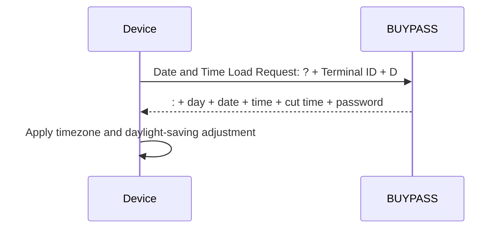

# Date and Time Load Message Templates

**Specification:** ATL105 2026-3, Section 11.7.3

## Flow

## Understanding

The request is positional and has no Field Separators. It contains Information Byte `?`, a 13-character Terminal Identifier and Load Type `D`. The response begins with Data Type Indicator `:` and contains Day of Week, Current Date, Current Time, Cut Time and Password. All response fields are host-sourced and positional.

The independent `DateTimeLoadPayloadValidator` checks the envelope, fixed marker, date/time widths and password shape.
