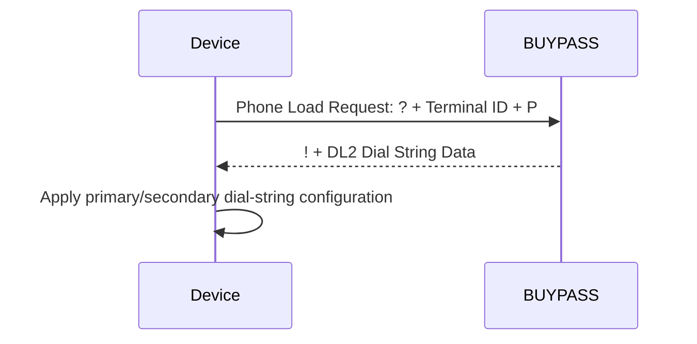

# Phone Load Message Templates

**Specification:** ATL105 2026-3, Section 11.7.2

## Flow

## Understanding

The request is positional and has no Field Separators. It contains Information Byte `?`, a 13-character Terminal Identifier and Load Type `P`. The response begins with Data Type Indicator `!` and carries DL2. DL2 uses its own self-delimited format: primary terminator `A`, secondary terminator `F`, and End-of-Data `~`.

Primary/secondary fallback behavior remains review-gated by the asynchronous communications protocol input. The independent `PhoneLoadPayloadValidator` checks the message envelope and fixed markers only.
