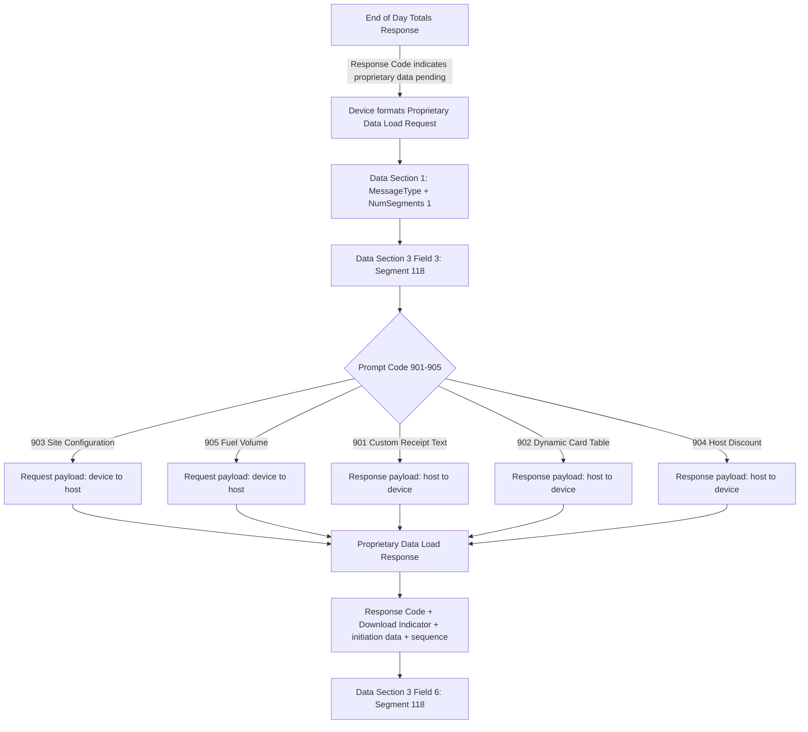

# Proprietary Data Load Message Templates

**Specification:** ATL105 2026-3, Sections 11.7.6-11.7.7 and 12.16-12.16.5
**Purpose:** Dedicated training module for the Segment 118 Proprietary Data Load Request/Response envelope and its Prompt Code payload directions.

## Flow Diagram

## Envelope

### Request

- Data Section 1 contains `MessageType` (Element 55) and `NumSegments` (Element 63), fixed at `1`.
- Data Section 2 / Segment 100 is explicitly absent.
- Data Section 3 Field 3 contains Segment 118.
- Request Segment 118 fields 1-13 use Field Separators, including empty fields; a separator follows field 13.
- Segment Length is four numeric digits and may be up to 3,800.

### Response

- Data Section 1 is positional and contains Response Code (83), Download Indicator (30), Initiation Date (45), Initiation Time (46) and Sequence Number (86).
- Data Section 3 Field 6 contains Segment 118.
- Response Segment 118 fields are positional, with no Field Separators.
- Response Code values are context-specific: `H`, `O`, `T`, `U`, `X`, `Y`, with `V`/`W` for pending Custom Receipt Text.

## Prompt Code Direction

| Prompt Code | Payload | Direction | Data shape |
|---:|---|---|---|
| 901 | Custom Receipt Text | Response only | Dates/times, line count and repeated text blocks, up to 220 bytes |
| 902 | Dynamic Card Table | Response only | Card Table Data, up to 3,600 bytes |
| 903 | Site Configuration | Request only | Site Configuration Data, up to 3,600 bytes |
| 904 | Host Discount | Response only | Discount header and repeated discount blocks, up to 3,600 bytes |
| 905 | Fuel Volume | Request only | Fuel Volume Data, up to 3,600 bytes |

## Training Understanding

1. This is a dedicated Proprietary Data Load message family, not a generic Financial Transaction companion.
2. Segment 118 is distinct from Communications Test Element 120 and Segment 120 Print Data 2.
3. Prompt Code determines the payload direction and fields after core field 13.
4. The request/response direction must be checked against the Prompt Code before validating payload fields.
5. The load is an End of Day / Day Close flow. A Totals Response is the trigger; the Proprietary Data Load cannot be treated as an arbitrary daytime request.
6. Segment 118 uses a four-digit Segment Length, unlike most numbered segments.
7. Block Number lifecycle is required for Site Configuration and multi-message flows; do not certify retry/echo behavior without the SME inputs.
8. Synthetic fixtures are Test Solution evidence only. AI BR -> TS -> TC -> TD -> mapping must be independently verified.

## Source Modules

- [Segment 118 knowledge module](../segment-118/README.md)
- [Segment 118 rule catalog](../segment-118/coverage/segment-118-rule-catalog.json)
- [Segment 118 flow](../segment-118/segment-118-flow.md)
- [Segment 118 SME/TBA register](../segment-118/segment-118-sme-tba-input-register.md)

## Next Gate

The envelope is specification-backed and documented. The next work is a dedicated validator/fixture slice for the request and response envelopes, followed by Prompt Code 903/905 request payloads and 901/902/904 response payloads. AI artifact comparison remains independent and must not be inferred from this Test Solution module.
