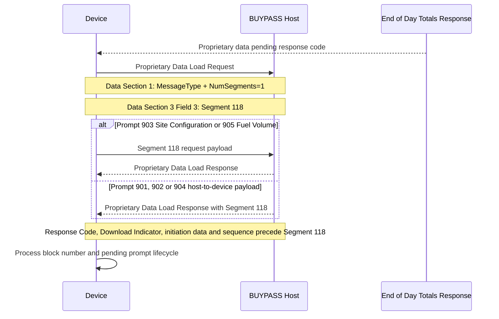

# Proprietary Data Load Flow

## Position and Framing

The request has a segmented envelope: Data Section 1, no Data Section 2/Segment 100, then Segment 118 in Data Section 3 Field 3. Request Segment 118 is field-separated.

The response has positional Data Section 1 fields followed by Segment 118 in Data Section 3 Field 6. Response Segment 118 has no Field Separators.

## Prompt Direction

- `901`, `902`, `904`: host-to-device response payloads.
- `903`, `905`: device-to-host request payloads.

The exact payload blocks are prompt-specific and must not be collapsed into one generic Segment 118 shape.
