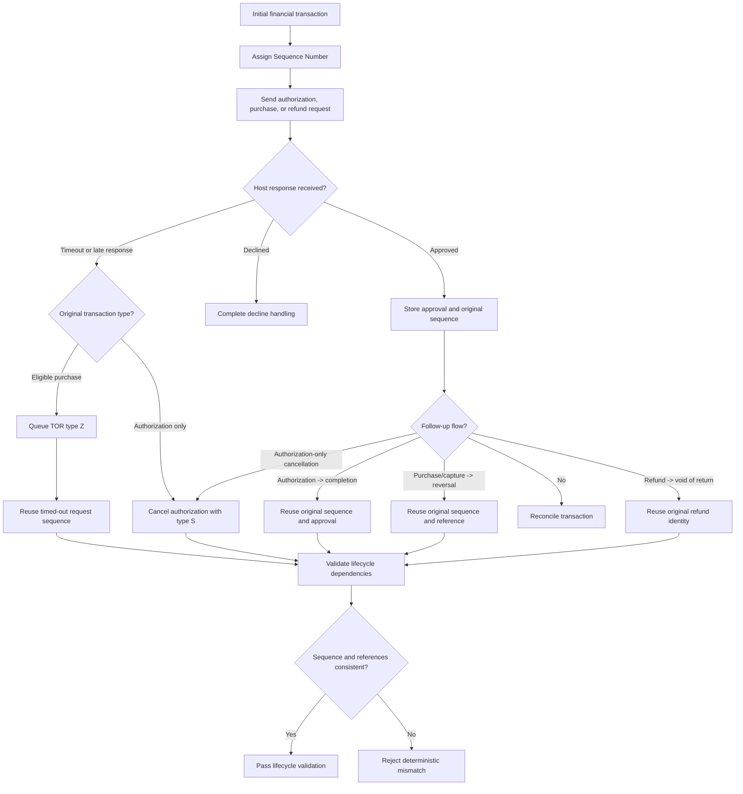

# Sequence and Lifecycle Correlation Flow

## Key Principle

A new Sequence Number for a follow-up message usually means the POS has lost the identity of the original transaction. That is a lifecycle defect even when the individual message fields look valid.

An Authorization Only Reversal uses Prompt Code `S` (cancellation), not purchase reversal/void code `8`. A timeout uses TOR code `Z` only for a source-eligible financial purchase; an authorization-only timeout is recovered with cancellation.

Do not model a direct Authorization Only -> code `8` reversal. An Authorization -> Completion -> Void chain is a distinct three-leg question: [SEG100-SME-002](segment-100-sme-tba-input-register.md) remains open on the void target and debit eligibility, so keep that chain `REVIEW_REQUIRED` until resolved.
