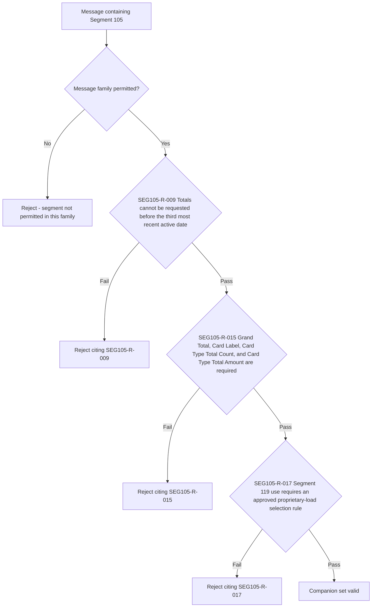

# Segment 105 Companion-Segment Compatibility Flow

```mermaid
flowchart TD
    A[Message containing Segment 105] --> B{Message family permitted?}
    B -->|No| X[Reject - segment not permitted in this family]
    B -->|Yes| C1{SEG105-R-009 Totals cannot be requested before the third most recent active date}
    C1 -->|Fail| F1[Reject citing SEG105-R-009]
    C1 -->|Pass| C2{SEG105-R-015 Grand Total, Card Label, Card Type Total Count, and Card Type Total Amount are required}
    C2 -->|Fail| F2[Reject citing SEG105-R-015]
    C2 -->|Pass| C3{SEG105-R-017 Segment 119 use requires an approved proprietary-load selection rule}
    C3 -->|Fail| F3[Reject citing SEG105-R-017]
    C3 -->|Pass| Z[Companion set valid]
```
