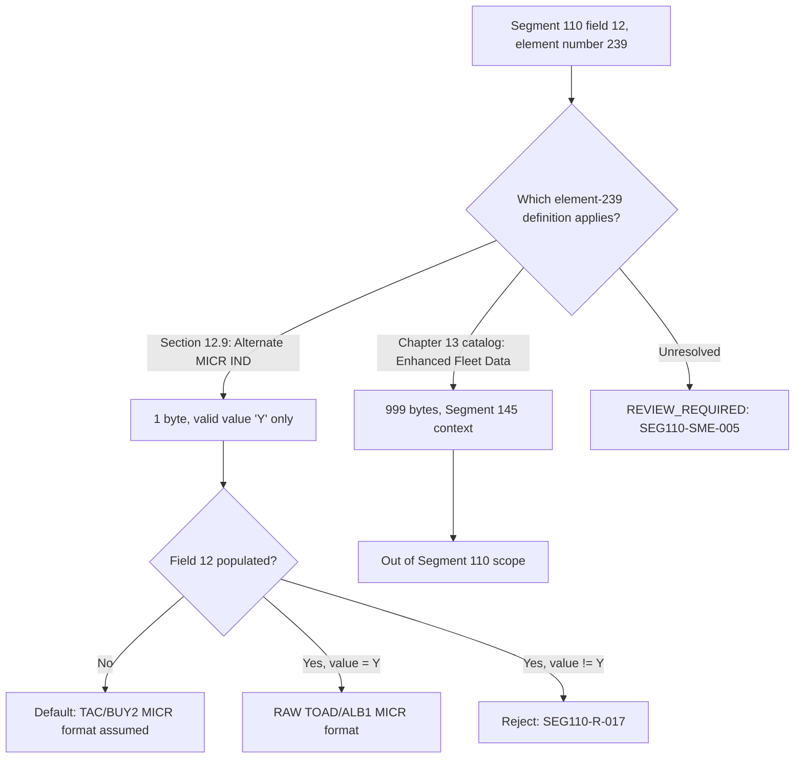

# Alternate MICR Indicator Decision Flow

```mermaid
flowchart TD
    A[Segment 110 field 12, element number 239] --> B{Which element-239 definition applies?}
    B -->|Section 12.9: Alternate MICR IND| C[1 byte, valid value 'Y' only]
    B -->|Chapter 13 catalog: Enhanced Fleet Data| D[999 bytes, Segment 145 context]
    C --> E{Field 12 populated?}
    D --> F[Out of Segment 110 scope]
    E -->|No| G[Default: TAC/BUY2 MICR format assumed]
    E -->|Yes, value = Y| H[RAW TOAD/ALB1 MICR format]
    E -->|Yes, value != Y| I[Reject: SEG110-R-017]
    B -->|Unresolved| J[REVIEW_REQUIRED: SEG110-SME-005]
```
