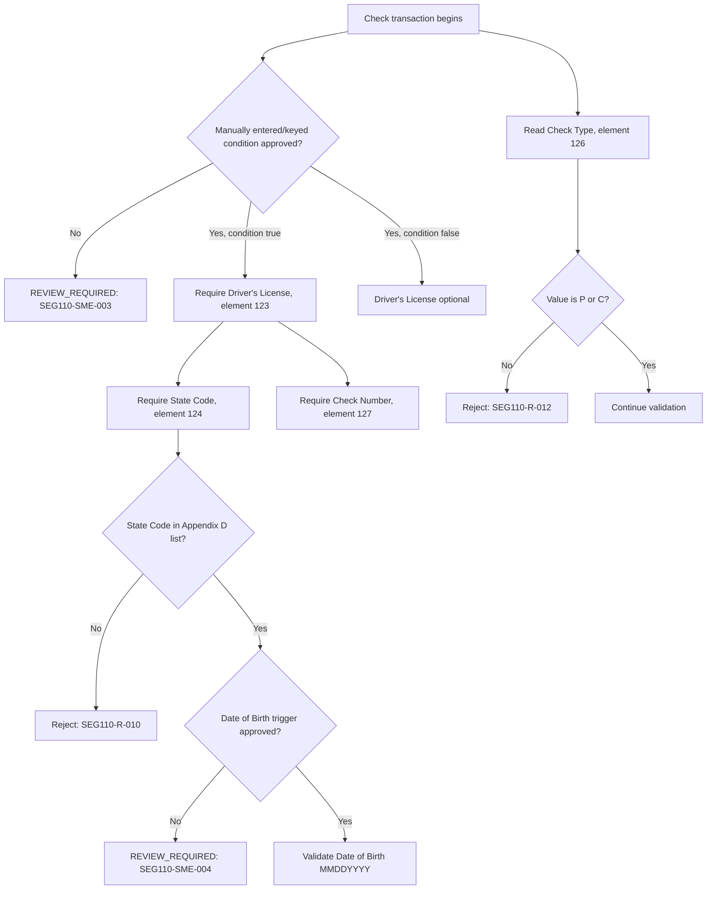

# Check Identification Fields Decision Flow

```mermaid
flowchart TD
    A[Check transaction begins] --> B{Manually entered/keyed condition approved?}
    B -->|No| C[REVIEW_REQUIRED: SEG110-SME-003]
    B -->|Yes, condition true| D[Require Driver's License, element 123]
    B -->|Yes, condition false| E[Driver's License optional]
    D --> F[Require State Code, element 124]
    F --> G{State Code in Appendix D list?}
    G -->|No| H[Reject: SEG110-R-010]
    G -->|Yes| I{Date of Birth trigger approved?}
    I -->|No| J[REVIEW_REQUIRED: SEG110-SME-004]
    I -->|Yes| K[Validate Date of Birth MMDDYYYY]
    D --> L[Require Check Number, element 127]
    A --> M[Read Check Type, element 126]
    M --> N{Value is P or C?}
    N -->|No| O[Reject: SEG110-R-012]
    N -->|Yes| P[Continue validation]
```
