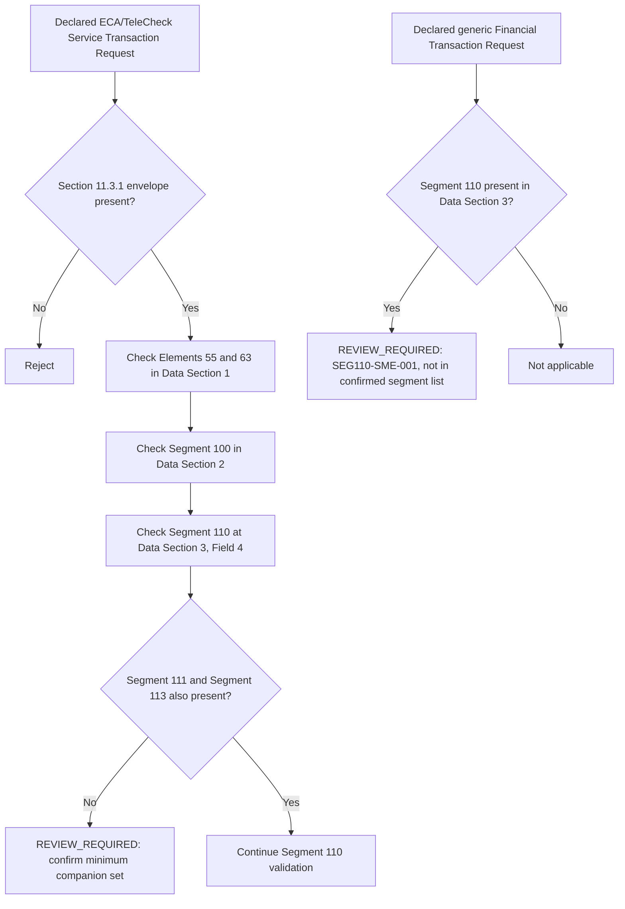

# Segment 110 Companion and Envelope Compatibility Flow

```mermaid
flowchart TD
    A[Declared ECA/TeleCheck Service Transaction Request] --> B{Section 11.3.1 envelope present?}
    B -->|No| C[Reject]
    B -->|Yes| D[Check Elements 55 and 63 in Data Section 1]
    D --> E[Check Segment 100 in Data Section 2]
    E --> F[Check Segment 110 at Data Section 3, Field 4]
    F --> G{Segment 111 and Segment 113 also present?}
    G -->|No| H[REVIEW_REQUIRED: confirm minimum companion set]
    G -->|Yes| I[Continue Segment 110 validation]
    A2[Declared generic Financial Transaction Request] --> J{Segment 110 present in Data Section 3?}
    J -->|Yes| K[REVIEW_REQUIRED: SEG110-SME-001, not in confirmed segment list]
    J -->|No| L[Not applicable]
```
