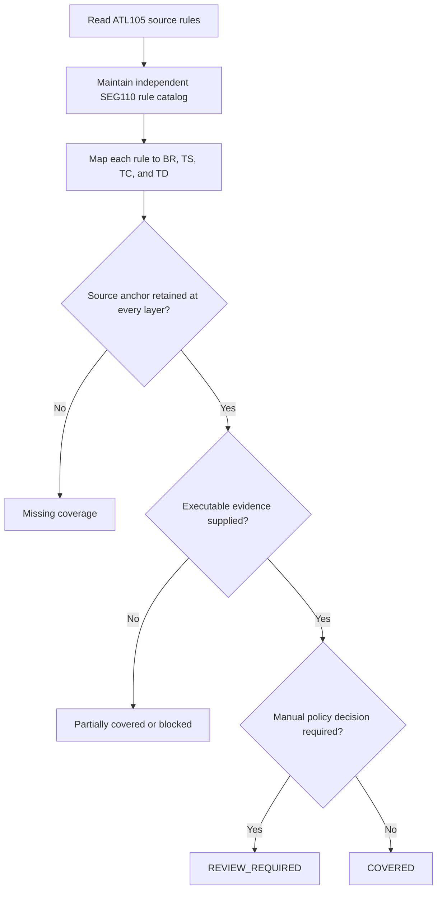

# Segment 110 Coverage Closure Flow

```mermaid
flowchart TD
    A[Read ATL105 source rules] --> B[Maintain independent SEG110 rule catalog]
    B --> C[Map each rule to BR, TS, TC, and TD]
    C --> D{Source anchor retained at every layer?}
    D -->|No| E[Missing coverage]
    D -->|Yes| F{Executable evidence supplied?}
    F -->|No| G[Partially covered or blocked]
    F -->|Yes| H{Manual policy decision required?}
    H -->|Yes| I[REVIEW_REQUIRED]
    H -->|No| J[COVERED]
```
