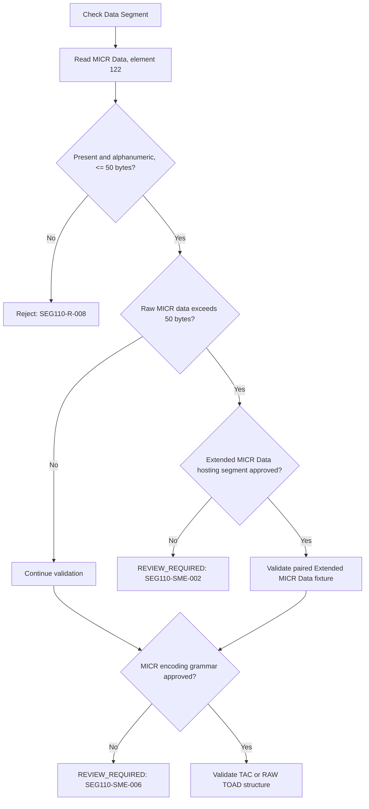

# MICR Data Decision Flow

```mermaid
flowchart TD
    A[Check Data Segment] --> B[Read MICR Data, element 122]
    B --> C{Present and alphanumeric, <= 50 bytes?}
    C -->|No| D[Reject: SEG110-R-008]
    C -->|Yes| E{Raw MICR data exceeds 50 bytes?}
    E -->|No| F[Continue validation]
    E -->|Yes| G{Extended MICR Data hosting segment approved?}
    G -->|No| H[REVIEW_REQUIRED: SEG110-SME-002]
    G -->|Yes| I[Validate paired Extended MICR Data fixture]
    F --> J{MICR encoding grammar approved?}
    I --> J
    J -->|No| K[REVIEW_REQUIRED: SEG110-SME-006]
    J -->|Yes| L[Validate TAC or RAW TOAD structure]
```
