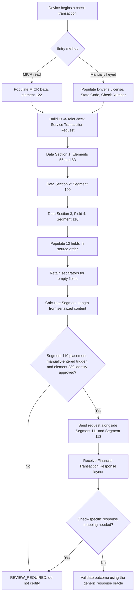

# Segment 110 End-to-End Flow

The review paths are intentional. They prevent a syntactically valid Segment 110 fixture from becoming false proof of an approved check-transaction flow, and they prevent the element-239 numbering conflict from silently resolving itself.
