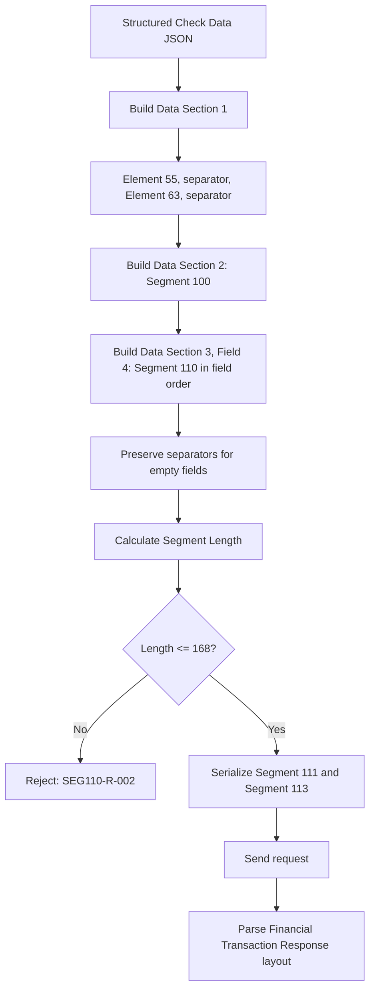

# Segment 110 Serialization and Wire-Format Flow

```mermaid
flowchart TD
    A[Structured Check Data JSON] --> B[Build Data Section 1]
    B --> C[Element 55, separator, Element 63, separator]
    C --> D[Build Data Section 2: Segment 100]
    D --> E[Build Data Section 3, Field 4: Segment 110 in field order]
    E --> F[Preserve separators for empty fields]
    F --> G[Calculate Segment Length]
    G --> H{Length <= 168?}
    H -->|No| I[Reject: SEG110-R-002]
    H -->|Yes| J[Serialize Segment 111 and Segment 113]
    J --> K[Send request]
    K --> L[Parse Financial Transaction Response layout]
```
