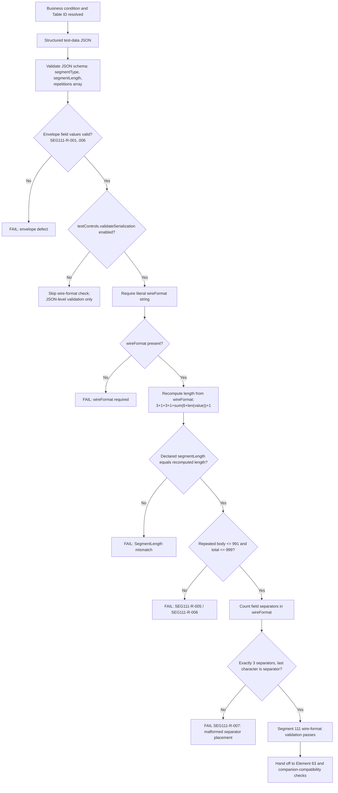

# Segment 111 Serialization and Wire-Format Flow

Segment 111 is conditionally included in Data Section 3. This deliverable validates
only the envelope and deliberately leaves Table-ID semantics to Appendix I.

## Wire Shape

`111` + field separator + three-digit total length + field separator + repeated
`indicator(3) + length(3) + variable-information` values, with no separators within
or between repetitions and one trailing separator after the final repetition.
`testControls.validateSerialization` gates these checks in the canonical package validator.



## Two Independent Validators

Segment 111 serialization is checked by two purpose-built validators that
must both pass:

| Validator | Input | What it proves |
| --- | --- | --- |
| `Segment111PayloadValidator` | Parsed JSON structure | Envelope field shapes, length/value equality per repetition, 991/999 caps computed from structural data (`SEG111-R-001..006`) |
| `Segment111SerializationValidator` | Literal `wireFormat` string, gated by `testControls.validateSerialization` | The actual serialized bytes contain the correct field separator count and trailing-separator placement (`SEG111-R-007`) |

A package can satisfy the JSON-level payload validator and still fail the
serialization validator if the literal wire bytes misplace a separator — this
is why the two checks are independent rather than one combined check.

## Layered Decision

```text
Business meaning (Table ID selection)
  -> logical JSON (indicator/length/value repetitions)
  -> serialized Segment 111 envelope
  -> complete ATL105 payload (Segment 100 + Segment 111 + other companions)
  -> executable test input
```

A failure at any layer must identify the representation, repetition index,
rule ID, and source anchor involved. See the
[Variable Information Length note](../variable-information-length-sme-tba-note.md)
and the
[repeated-section boundary note](../repeated-section-boundary-sme-tba-note.md)
for the length- and separator-specific reasoning that this flow depends on.
