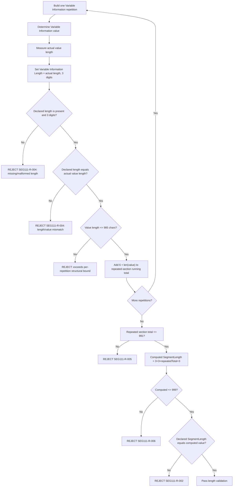

# Variable Information Length Dependency Flow

## Key Principle

There are three independent length checks, and confusing them is the most
common analysis error:

1. **Per-repetition check**: declared Variable Information Length must equal
   the actual value length (`SEG111-R-004`). This is proven wrong by the
   negative fixture
   [`variable-info-length-mismatch.synthetic.json`](../../../../test-input/ai-solution/test-data/segment-111/rejection/variable-info-length-mismatch.synthetic.json),
   where a declared length of `004` accompanies a 3-character value.
2. **Repeated-section check**: the sum of every repetition's `6 + len(value)`
   contribution (3-digit indicator + 3-digit length + value) must not exceed
   991 characters (`SEG111-R-005`).
3. **Envelope check**: the declared Segment Length must equal the fully
   computed structural length — `3 + 3 + repeatedTotal + 3` — and that
   computed value must not exceed 999 characters (`SEG111-R-002`,
   `SEG111-R-006`).

A JSON payload can satisfy check 1 for every repetition and still fail check 2
or 3 if too many repetitions are combined.
