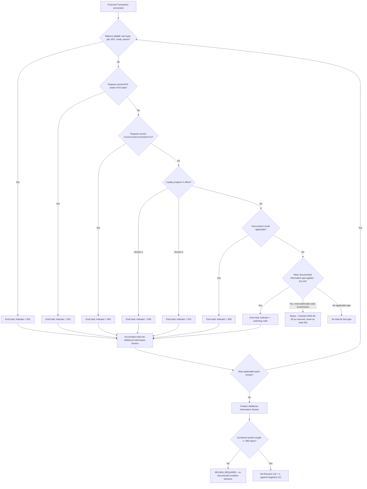

# Additional Information Indicator (Element 116) Decision Flow

This diagram shows how the host selects which Additional Information triads to include in Segment 112, based on what the Financial Transaction Request/Response context requires.

## How to Read the Flow

- Multiple triads can and commonly do coexist in a single Segment 112 (for example, AVS `003` and CVV `004` together).
- Each documented Element 116 code has its own Element 118 shape; some are fixed-length (`012`, `013`, `017`, `018`), most are variable-length governed by Element 117.
- Reserved/invalid codes (`002`, `014`, `015`, `033`) must be rejected outright (resolved 2026-09-26) — see [SEG112-SME-002](../segment-112-sme-tba-input-register.md).
- This flow governs *selection* of triads; the [serialization flow](../serialization-wire-format/serialization-wire-format-flow.md) governs how the selected triads are encoded onto the wire.
