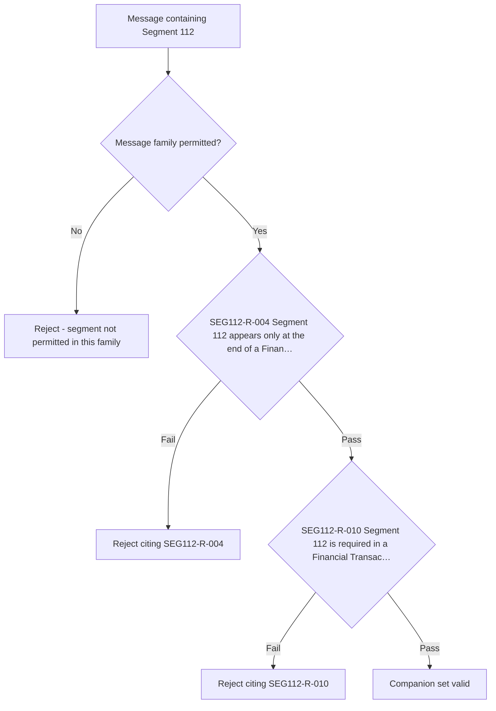

# Segment 112 Companion-Segment Compatibility Flow

```mermaid
flowchart TD
    A[Message containing Segment 112] --> B{Message family permitted?}
    B -->|No| X[Reject - segment not permitted in this family]
    B -->|Yes| C1{SEG112-R-004 Segment 112 appears only at the end of a Finan…}
    C1 -->|Fail| F1[Reject citing SEG112-R-004]
    C1 -->|Pass| C2{SEG112-R-010 Segment 112 is required in a Financial Transac…}
    C2 -->|Fail| F2[Reject citing SEG112-R-010]
    C2 -->|Pass| Z[Companion set valid]
```
