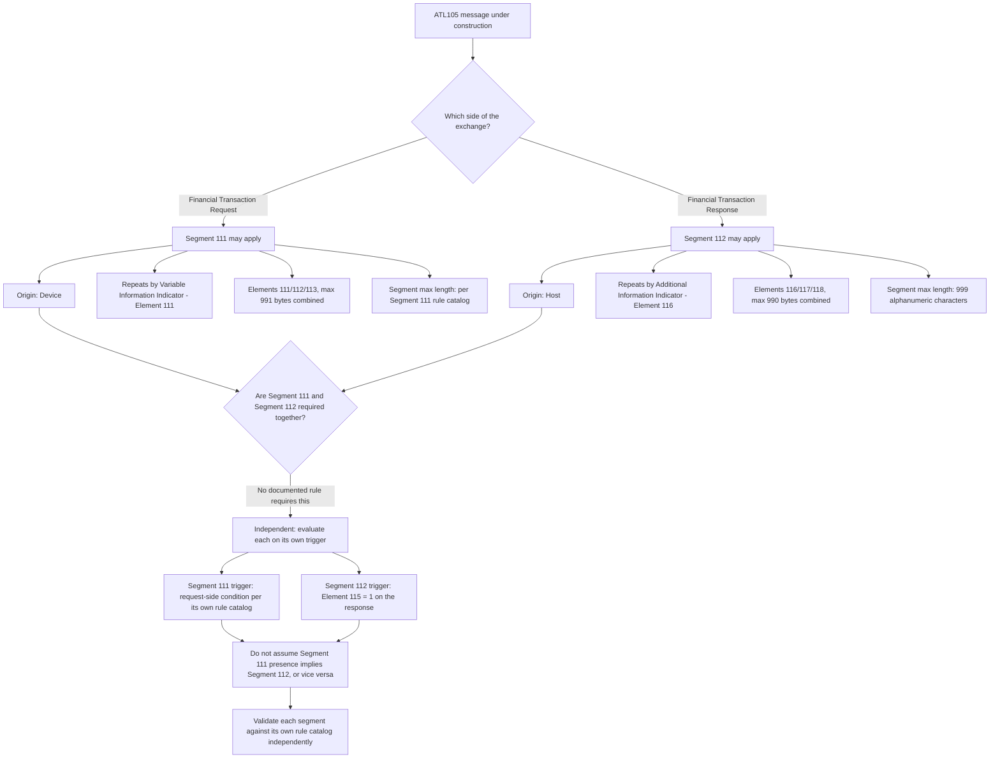

# Segment 111 vs. Segment 112 Companion-Segment Compatibility Flow

Segment 111 (Variable Information Data Segment) and Segment 112 (Additional Information Data Segment) are structurally parallel but functionally and directionally independent. This flow exists to prevent test-data authors from confusing or conflating them.

## How to Read the Flow

- Segment 111 and Segment 112 share the same repeating-triad shape (Indicator/Length/Value) but are not the same segment, not on the same side of the exchange, and not co-required.
- A test-data author who copies a Segment 111 fixture and merely renumbers the segment type risks importing request-side assumptions (device origin, Element 111 codes, 991-byte cap) into a response-side Segment 112 fixture (host origin, Element 116 codes, 990-byte cap).
- No specification text in Section 12.10 or 12.11 states that one segment's presence requires the other; treat any such assumption as unverified until an SME confirms it with a citation.
