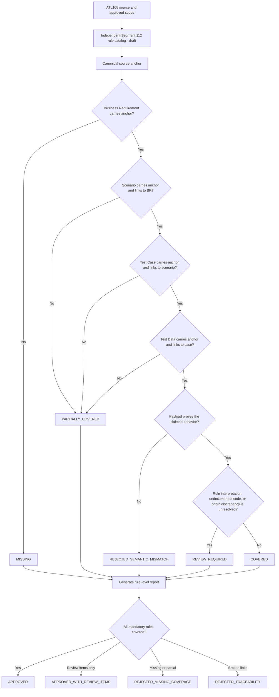

# Segment 112 Coverage Closure Flow

## Human Checkpoints

### Checkpoint 1: Scope approval

The SME/TBA confirms which Segment 112 rules belong in this release, including whether Appendix K sub-table layouts (Phase 2+) are in scope.

### Checkpoint 2: Rule catalog approval

The Test Team confirms that each catalog row is atomic, sourced, and testable. Segment 112 currently has 10 core rules; the Element 116 value catalog (47 codes) is documented separately as business requirements pending promotion into machine-readable rules.

### Checkpoint 3: Artifact mapping approval

The Test Team confirms that source anchors are semantically equivalent even when local IDs differ (see the [AI-to-Test requirement crosswalk](segment-112-ai-to-test-requirement-crosswalk.md) for the current state of this mapping).

### Checkpoint 4: Semantic evidence approval

The SME/TBA confirms that the payload actually represents the intended host-response behavior (correct Element 116 code, correct Element 118 shape, correct byte caps).

### Checkpoint 5: Certification approval

The Test Team decides whether review items (Segment Type origin discrepancy, undocumented Element 116 codes, Element 115 cross-catalog placement) block release, and records the decision with the report.

## Important Principle

A percentage such as "95% covered" is not sufficient evidence. The report must identify the exact uncovered rule, missing artifact, semantic mismatch, or unresolved business interpretation — same principle as Segment 100.
