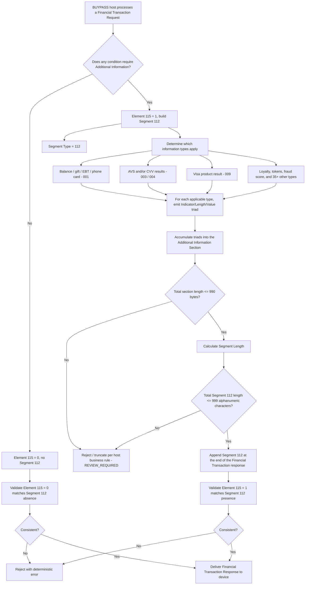

# Segment 112 End-to-End Flow

This diagram shows the business and technical decision path for the ATL105 Additional Information Data Segment, a host-originated, response-only carrier of supplemental transaction data.

## How to Read the Flow

- Segment 112 is entirely response-side and host-authored; the device never constructs it.
- The `Additional Information Section` (Indicator/Length/Value) can repeat multiple times in one Segment 112, once per applicable information type, capped at 990 bytes combined.
- The overall segment cap (999 bytes) is a separate, larger boundary than the repeating-section cap (990 bytes); both must be validated independently.
- Element 115 and Segment 112 presence must agree in both directions: `1` without a segment, or a segment without `1`, are both structural defects.
- "REVIEW_REQUIRED" nodes mark boundary conditions the specification does not fully resolve (see the [SME/TBA Input Register](segment-112-sme-tba-input-register.md)); do not treat them as an automatic pass.
