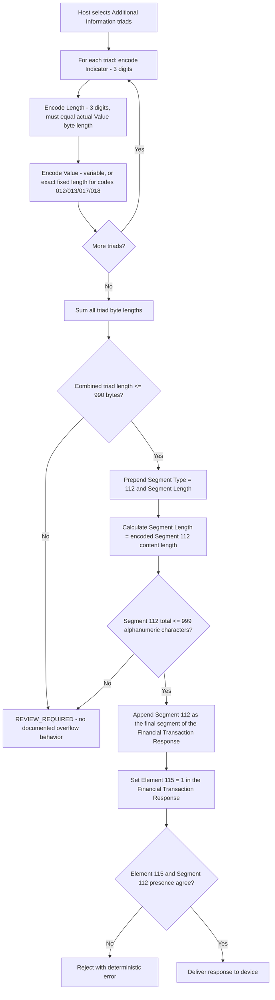

# Segment 112 Serialization and Wire-Format Flow

## How to Read the Flow

- Encoding happens per-triad first (Indicator/Length/Value), then the triads are summed and bounded (990 bytes), then the whole segment is bounded (999 bytes) — three independent checks, not one.
- Fixed-length codes must match their documented exact length; do not treat their Element 117 as "any value up to the max."
- The final placement and Element 115 consistency check happens after the segment itself is valid — a syntactically perfect Segment 112 in the wrong position, or without a matching Element 115, is still a defect.
