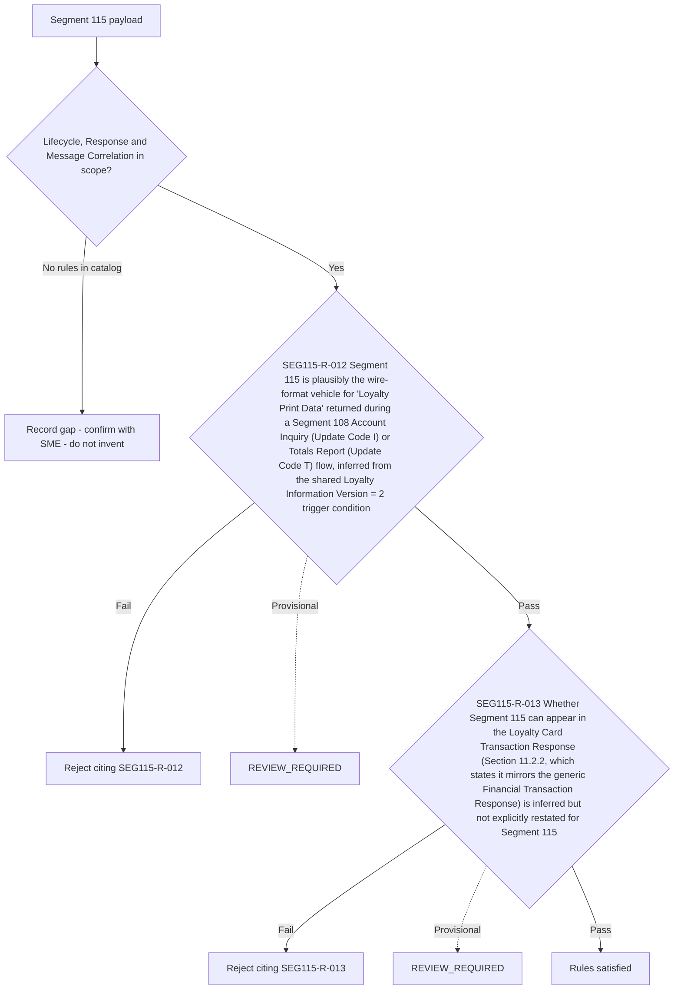

# Segment 115 Lifecycle, Response and Message Correlation Flow

Rules are evaluated in catalog order. Provisional rules are shown with a dotted branch: they are documented but must not be certified as covered until the linked SME item is resolved.

Source: [segment-115-rule-catalog.json](coverage/segment-115-rule-catalog.json) · Note: [lifecycle-response-correlation-sme-tba-note.md](lifecycle-response-correlation-sme-tba-note.md)
