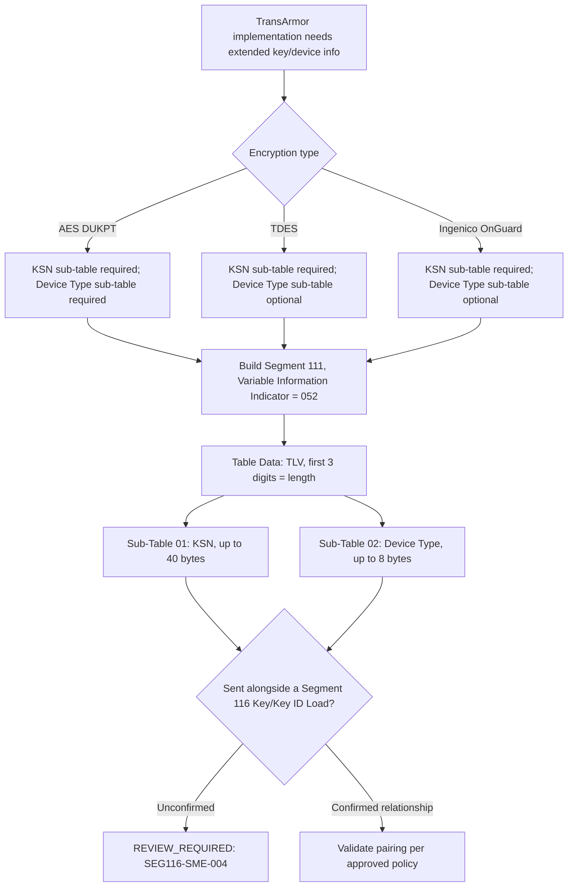

# Additional TransArmor Data (Segment 111 Companion) Decision Flow

```mermaid
flowchart TD
    A[TransArmor implementation needs extended key/device info] --> B{Encryption type}
    B -->|AES DUKPT| C[KSN sub-table required; Device Type sub-table required]
    B -->|TDES| D[KSN sub-table required; Device Type sub-table optional]
    B -->|Ingenico OnGuard| E[KSN sub-table required; Device Type sub-table optional]
    C --> F[Build Segment 111, Variable Information Indicator = 052]
    D --> F
    E --> F
    F --> G[Table Data: TLV, first 3 digits = length]
    G --> H[Sub-Table 01: KSN, up to 40 bytes]
    G --> I[Sub-Table 02: Device Type, up to 8 bytes]
    H --> J{Sent alongside a Segment 116 Key/Key ID Load?}
    I --> J
    J -->|Unconfirmed| K[REVIEW_REQUIRED: SEG116-SME-004]
    J -->|Confirmed relationship| L[Validate pairing per approved policy]
```
