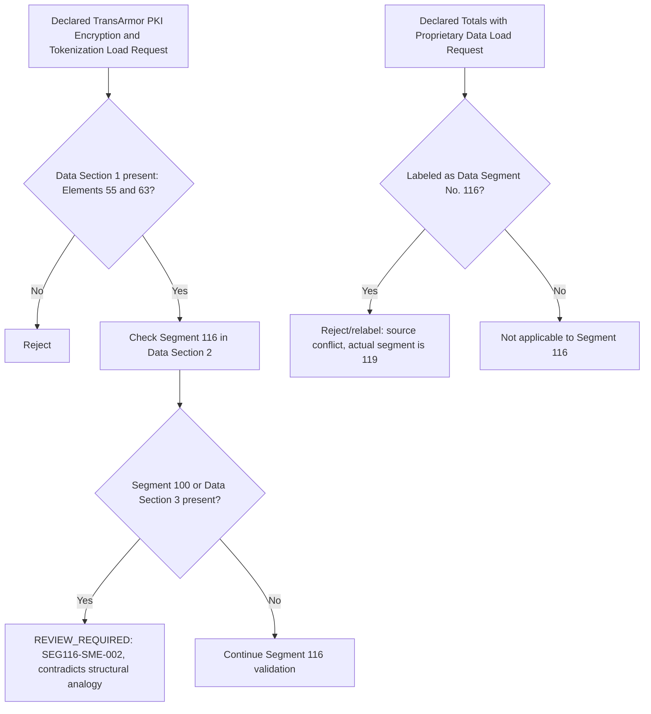

# Segment 116 Companion and Envelope Compatibility Flow

```mermaid
flowchart TD
    A[Declared TransArmor PKI Encryption and Tokenization Load Request] --> B{Data Section 1 present: Elements 55 and 63?}
    B -->|No| C[Reject]
    B -->|Yes| D[Check Segment 116 in Data Section 2]
    D --> E{Segment 100 or Data Section 3 present?}
    E -->|Yes| F[REVIEW_REQUIRED: SEG116-SME-002, contradicts structural analogy]
    E -->|No| G[Continue Segment 116 validation]
    A2[Declared Totals with Proprietary Data Load Request] --> H{Labeled as Data Segment No. 116?}
    H -->|Yes| I[Reject/relabel: source conflict, actual segment is 119]
    H -->|No| J[Not applicable to Segment 116]
```
