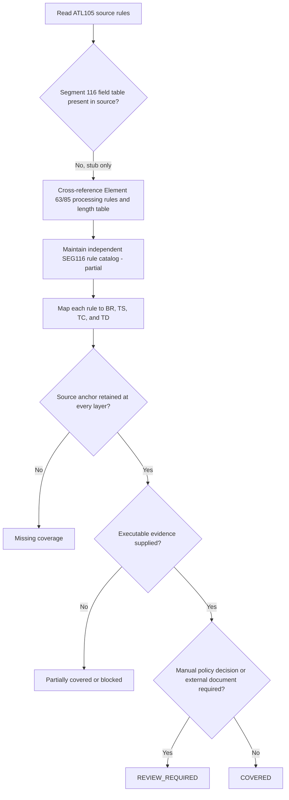

# Segment 116 Coverage Closure Flow

```mermaid
flowchart TD
    A[Read ATL105 source rules] --> B{Segment 116 field table present in source?}
    B -->|No, stub only| C[Cross-reference Element 63/85 processing rules and length table]
    C --> D[Maintain independent SEG116 rule catalog - partial]
    D --> E[Map each rule to BR, TS, TC, and TD]
    E --> F{Source anchor retained at every layer?}
    F -->|No| G[Missing coverage]
    F -->|Yes| H{Executable evidence supplied?}
    H -->|No| I[Partially covered or blocked]
    H -->|Yes| J{Manual policy decision or external document required?}
    J -->|Yes| K[REVIEW_REQUIRED]
    J -->|No| L[COVERED]
```
