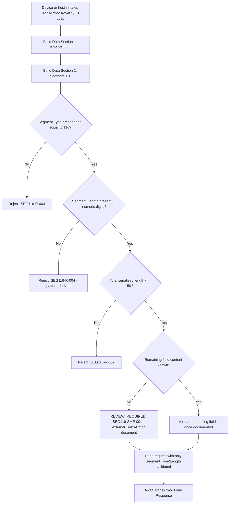

# TransArmor Key and Key ID Load Decision Flow

This flow deliberately stops at "REVIEW_REQUIRED" rather than inventing a field list. A syntactically valid Segment 116 fixture built from only Segment Type and Segment Length must not be presented as proof of a complete Key/Key ID Load request.
